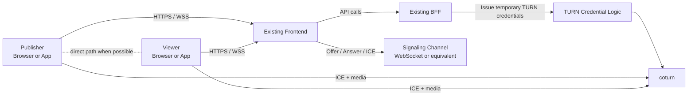

# WebRTC + TURN Integration Design

This document explains how to integrate the validated relay solution into:

- an existing frontend application
- an existing BFF service

The goal is to move from the demo in this repository to a production-style architecture without changing the core relay strategy:

- direct WebRTC on good networks
- TURN relay fallback on restricted networks

## Scope

This design covers:

- frontend responsibilities
- BFF responsibilities
- signaling responsibilities
- TURN credential issuance
- media connection flow
- recommended rollout plan

This design does not prescribe:

- a specific frontend framework
- a specific backend framework
- a specific database

## Validated Strategy

The solution validated in real networks is:

1. the user opens the web page through a trusted HTTPS entrypoint
2. the frontend establishes signaling with the application backend
3. the frontend creates a `RTCPeerConnection`
4. WebRTC first attempts direct connectivity when allowed
5. if direct connectivity is not possible, ICE selects TURN relay candidates
6. media flows through `coturn`

In forced-relay validation mode, the selected candidate pair was:

```text
relay / udp / relay->relay
```

That proves the TURN path is functional.

## Recommended Production Architecture



## Responsibility Split

### Frontend

The frontend should be responsible for:

- collecting or rendering media
- requesting temporary TURN credentials from the BFF
- opening the signaling channel
- creating and managing `RTCPeerConnection`
- exchanging SDP and ICE data through signaling
- showing connection state and diagnostics

The frontend should not:

- embed a long-lived TURN secret
- hardcode production TURN credentials
- generate TURN HMAC credentials locally

### BFF

The BFF should be responsible for:

- authenticating the current user or device
- authorizing session creation and session join
- issuing temporary TURN credentials
- creating or validating room/session identifiers
- providing signaling authentication context
- optionally persisting session metadata

The BFF should not:

- proxy WebRTC media
- act as the TURN server

### Signaling Service

The signaling layer can be implemented:

- inside the BFF itself
- as a sidecar service
- as a dedicated signaling service

Its responsibilities are:

- room membership
- publisher/viewer discovery
- SDP offer exchange
- SDP answer exchange
- ICE candidate exchange
- session cleanup

The demo in this repository uses a single Node.js process for signaling because it is the smallest possible implementation. In a real system, it is reasonable to move signaling into your existing BFF if that service already exposes authenticated WebSocket infrastructure.

### coturn

`coturn` is responsible for:

- STUN responses
- TURN allocation
- relay transport

`coturn` is not responsible for:

- authentication of your product users
- room logic
- session orchestration
- signaling

## End-to-End Flow

### Normal Mode

1. publisher opens the application
2. publisher requests session bootstrap data from the BFF
3. BFF returns:
   - room/session ID
   - signaling endpoint
   - temporary TURN credentials
   - ICE server list
4. publisher opens signaling
5. viewer opens the same session
6. viewer requests bootstrap data from the BFF
7. viewer opens signaling
8. publisher creates an offer
9. signaling forwards the offer to viewer
10. viewer creates an answer
11. signaling forwards the answer to publisher
12. both sides exchange ICE candidates
13. ICE selects:
   - direct path if possible
   - TURN relay if necessary

### Forced Relay Validation Mode

For diagnostics, allow a test-only mode where the frontend sets:

```js
iceTransportPolicy: "relay"
```

This is useful for:

- validating a new TURN deployment
- validating security group or firewall rules
- reproducing failures in restricted networks

Do not make forced relay the default production behavior unless your product explicitly wants every session to relay.

## Integration Into an Existing Frontend

Your existing frontend typically needs four modules.

### 1. Session Bootstrap Client

This module calls the BFF to obtain:

- session ID
- current user role
- signaling URL
- TURN credentials
- ICE server configuration

Example response shape:

```json
{
  "sessionId": "session_123",
  "role": "viewer",
  "signalingUrl": "wss://api.example.com/ws/webrtc",
  "iceServers": [
    {
      "urls": [
        "turn:turn.example.com:3478?transport=udp",
        "turn:turn.example.com:3478?transport=tcp"
      ],
      "username": "temporary-username",
      "credential": "temporary-credential"
    }
  ]
}
```

### 2. Signaling Client

This module should:

- connect to the signaling endpoint
- join a session
- send and receive:
  - `offer`
  - `answer`
  - `candidate`
  - peer state events

You can keep the message shape very close to the demo:

```json
{
  "type": "signal",
  "to": "peer-id",
  "data": {
    "offer": {}
  }
}
```

### 3. Peer Connection Manager

This module should:

- create `RTCPeerConnection`
- attach local tracks for publisher roles
- attach remote tracks for viewers
- report:
  - ICE state
  - connection state
  - selected candidate pair

### 4. Diagnostics UI

For rollout and support, expose at least:

- current room/session ID
- peer connection state
- selected candidate pair summary
- relay vs direct indicator

The demo's `relay / udp / relay->relay` style summary is simple and worth keeping.

## Integration Into an Existing BFF

Your BFF usually needs three new capabilities.

### 1. TURN Credential Endpoint

The BFF should expose an authenticated endpoint such as:

```text
POST /api/webrtc/turn-credential
```

or return TURN data as part of a session bootstrap endpoint.

The BFF should generate temporary credentials from a server-side TURN secret using the standard `use-auth-secret` flow supported by `coturn`.

The frontend should never receive the shared secret itself.

### 2. Session Bootstrap Endpoint

Recommended endpoint:

```text
POST /api/webrtc/sessions
GET /api/webrtc/sessions/:id
```

Typical data returned:

- session ID
- role
- signaling URL
- ICE servers
- optional feature flags:
  - forced relay enabled for test users
  - diagnostics enabled

### 3. Signaling Authentication

If signaling is WebSocket-based, the BFF should provide:

- cookie-based auth
- JWT auth
- signed session token

The signaling layer should validate:

- the caller is authenticated
- the caller can join the session
- the caller has the correct role

## TURN Credential Design

Use `coturn` with:

```conf
use-auth-secret
static-auth-secret=YOUR_SHARED_SECRET
realm=turn.example.com
```

The BFF generates temporary credentials:

- `username`: typically `expiry:user-id`
- `credential`: `base64(hmac_sha1(secret, username))`

Recommended TTL:

- `5` to `60` minutes for interactive sessions

Do not:

- issue permanent credentials to browsers
- store real TURN secrets in frontend config

## ICE Configuration Strategy

Recommended production strategy:

```js
{
  iceServers: [
    { urls: "stun:stun.l.google.com:19302" },
    {
      urls: [
        "turn:turn.example.com:3478?transport=udp",
        "turn:turn.example.com:3478?transport=tcp",
        "turns:turn.example.com:5349?transport=tcp"
      ],
      username,
      credential
    }
  ],
  iceTransportPolicy: "all"
}
```

Recommended validation strategy:

```js
{
  iceServers: [
    {
      urls: [
        "turn:turn.example.com:3478?transport=udp",
        "turn:turn.example.com:3478?transport=tcp"
      ],
      username,
      credential
    }
  ],
  iceTransportPolicy: "relay"
}
```

## Where To Put Signaling

There are three reasonable options.

### Option A: Signaling Inside the Existing BFF

Use this when:

- the BFF already supports WebSocket infrastructure
- session scale is moderate
- deployment simplicity matters

Pros:

- fewer services
- simpler auth reuse
- easier session authorization

Cons:

- BFF becomes responsible for long-lived socket load

### Option B: Dedicated Signaling Service

Use this when:

- session concurrency is high
- your BFF should stay request-response focused
- you want separate scaling or failure domains

Pros:

- cleaner separation
- easier horizontal scaling

Cons:

- extra service to deploy and observe

### Option C: Managed Realtime Backend

Use this when:

- you already have a managed realtime layer
- you want to minimize backend implementation work

Pros:

- faster initial delivery

Cons:

- less protocol control
- possible vendor coupling

## Security Design

### Frontend

- never embed long-lived TURN secrets
- never trust client-provided role claims
- avoid exposing diagnostics to all users by default

### BFF

- authenticate every signaling join
- authorize every session access
- issue short-lived TURN credentials
- rate-limit session creation and TURN credential issuance

### TURN

- use temporary credentials only
- keep relay port ranges explicit
- restrict security group rules to the required ranges
- use TLS when your network constraints require it

## Observability

At minimum, capture:

- session created
- session joined
- session role
- ICE connected / failed
- selected candidate summary
- relay vs direct outcome

Useful derived metrics:

- relay usage rate
- direct success rate
- median call setup time
- ICE failure rate by network type

## Rollout Plan

### Phase 1: Internal Validation

- use forced relay mode
- verify TURN path in real networks
- verify selected candidate shows `relay`

### Phase 2: Controlled Fallback

- switch default policy to `all`
- keep TURN configured
- observe direct-vs-relay ratios

### Phase 3: Product Integration

- replace demo UI with product UI
- move bootstrap and signaling into the real frontend/BFF flow
- keep diagnostics available for internal support

## Minimal Integration Checklist

Frontend:

- session bootstrap API client
- signaling client
- peer connection manager
- diagnostics indicator

BFF:

- session bootstrap endpoint
- TURN credential generation
- signaling authentication and authorization

Infrastructure:

- `coturn`
- firewall/security-group rules
- HTTPS entrypoint for the app

## Suggested Repository Mapping

If this demo evolves into a larger product, a clean split is:

```text
frontend/
  webrtc/
    sessionBootstrap.ts
    signalingClient.ts
    peerConnection.ts
    diagnostics.ts

bff/
  webrtc/
    sessionController.ts
    turnCredentialService.ts
    signalingAuth.ts

infra/
  coturn/
    turnserver.conf.example
```

## Final Recommendation

For most teams with an existing frontend and BFF, the pragmatic first production step is:

1. keep `coturn` as a separate infrastructure component
2. add temporary TURN credential issuance to the BFF
3. add signaling to the BFF if WebSocket support already exists
4. move the demo's frontend WebRTC logic into a dedicated frontend module
5. preserve the relay/direct diagnostics view for rollout and support

That path is the smallest jump from this validated demo to a maintainable production implementation.
