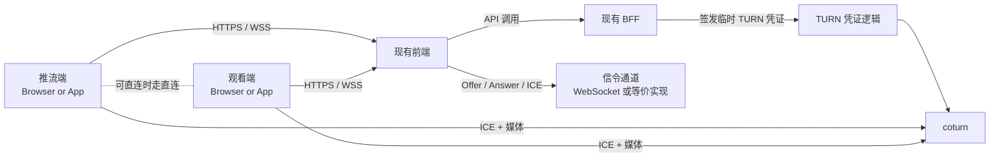

# WebRTC + TURN 接入设计文档

本文档说明如何把已经验证成功的 relay 方案，接入到：

- 一个现有前端工程
- 一个现有 BFF 工程

目标是把本仓库里的 demo 演进成正式架构，同时保持核心策略不变：

- 网络良好时优先直连
- 网络受限时回退到 TURN relay

## 文档范围

本文档覆盖：

- 前端职责
- BFF 职责
- 信令职责
- TURN 凭证签发
- 媒体连接流程
- 推荐落地路径

本文档不强制规定：

- 前端框架
- 后端框架
- 数据库选型

## 已验证的方案

真实网络里验证成功的方案是：

1. 用户通过可信 HTTPS 页面进入应用
2. 前端通过业务后端建立信令
3. 前端创建 `RTCPeerConnection`
4. WebRTC 在允许的情况下先尝试直连
5. 如果直连失败，ICE 自动选择 TURN relay candidate
6. 媒体通过 `coturn` 中继

在强制 relay 验证模式下，最终选中的候选对是：

```text
relay / udp / relay->relay
```

这说明 TURN 路径已经真实承载了媒体流。

## 推荐正式架构



## 职责边界

### 前端职责

前端负责：

- 采集或播放媒体
- 从 BFF 获取临时 TURN 凭证
- 建立信令连接
- 创建并管理 `RTCPeerConnection`
- 通过信令交换 SDP 和 ICE candidate
- 展示连接状态和诊断信息

前端不应该负责：

- 保存长期 TURN secret
- 硬编码正式 TURN 用户名密码
- 在客户端生成 TURN HMAC 凭证

### BFF 职责

BFF 负责：

- 认证当前用户或设备
- 校验用户是否有权发起或加入会话
- 签发临时 TURN 凭证
- 创建或校验 room / session
- 为信令提供认证上下文
- 视需要存储会话元数据

BFF 不负责：

- 转发 WebRTC 媒体流
- 替代 TURN 服务器

### 信令层职责

信令层可以放在：

- BFF 内部
- 独立 sidecar
- 独立 signaling service

信令层负责：

- 房间成员管理
- 推流端 / 观看端发现
- SDP offer 交换
- SDP answer 交换
- ICE candidate 交换
- 会话清理

本仓库里的 demo 用单个 Node.js 进程做信令，只是为了保持最小实现。在正式系统里，如果现有 BFF 已经支持认证后的 WebSocket，通常直接接到 BFF 内部是最自然的做法。

### coturn 职责

`coturn` 负责：

- STUN 响应
- TURN allocation
- relay 传输

`coturn` 不负责：

- 你的业务用户认证
- 房间逻辑
- 会话编排
- 信令交换

## 端到端流程

### 正常模式

1. publisher 打开应用
2. publisher 向 BFF 请求会话初始化数据
3. BFF 返回：
   - session ID
   - signaling URL
   - 临时 TURN 凭证
   - ICE server 列表
4. publisher 建立 signaling
5. viewer 打开同一个 session
6. viewer 也向 BFF 请求初始化数据
7. viewer 建立 signaling
8. publisher 创建 offer
9. 信令层把 offer 发给 viewer
10. viewer 创建 answer
11. 信令层把 answer 发回 publisher
12. 双方继续交换 ICE candidate
13. ICE 最终选择：
   - 能直连就走直连
   - 不能直连就走 TURN relay

### 强制 relay 验证模式

为了诊断和上线验证，建议保留一个测试模式，在前端把：

```js
iceTransportPolicy: "relay"
```

强制打开。

这个模式适用于：

- 验证新部署的 TURN
- 验证安全组和防火墙规则
- 在受限网络里复现问题

除非产品明确要求所有会话都强制中继，否则不应该把它作为正式默认行为。

## 如何接入现有前端

现有前端通常需要补四块能力。

### 1. 会话初始化模块

负责向 BFF 请求：

- session ID
- 当前角色
- signaling URL
- TURN 凭证
- ICE server 配置

一个典型返回可以是：

```json
{
  "sessionId": "session_123",
  "role": "viewer",
  "signalingUrl": "wss://api.example.com/ws/webrtc",
  "iceServers": [
    {
      "urls": [
        "turn:turn.example.com:3478?transport=udp",
        "turn:turn.example.com:3478?transport=tcp"
      ],
      "username": "temporary-username",
      "credential": "temporary-credential"
    }
  ]
}
```

### 2. 信令客户端

这个模块负责：

- 建立 signaling 连接
- 加入 session
- 收发：
  - `offer`
  - `answer`
  - `candidate`
  - peer 状态事件

消息结构可以和 demo 非常接近：

```json
{
  "type": "signal",
  "to": "peer-id",
  "data": {
    "offer": {}
  }
}
```

### 3. PeerConnection 管理模块

这个模块负责：

- 创建 `RTCPeerConnection`
- 为 publisher 挂载本地媒体轨
- 为 viewer 渲染远端媒体轨
- 输出：
  - ICE 状态
  - connection 状态
  - selected candidate pair

### 4. 诊断信息 UI

为了上线阶段排障，建议至少暴露：

- 当前 room / session ID
- peer connection 状态
- 最终候选对摘要
- 当前是直连还是 relay

demo 里的 `relay / udp / relay->relay` 这种摘要形式非常适合保留。

## 如何接入现有 BFF

现有 BFF 通常需要新增三块能力。

### 1. TURN 凭证接口

建议提供一个认证后的接口，例如：

```text
POST /api/webrtc/turn-credential
```

或者直接在 session bootstrap 接口里返回 TURN 凭证。

BFF 应该基于 `coturn` 的 `use-auth-secret` 机制生成临时凭证。

前端不应该拿到 TURN shared secret 本身。

### 2. Session Bootstrap 接口

推荐接口：

```text
POST /api/webrtc/sessions
GET /api/webrtc/sessions/:id
```

返回内容通常包括：

- session ID
- role
- signaling URL
- ICE servers
- 可选 feature flags：
  - 是否为测试用户开启 forced relay
  - 是否开启诊断 UI

### 3. 信令认证

如果 signaling 基于 WebSocket，BFF 需要提供：

- Cookie 认证
- JWT 认证
- 或带签名的 session token

信令层必须校验：

- 调用方已认证
- 调用方有权加入该 session
- 调用方拥有正确角色

## TURN 凭证设计

`coturn` 建议配置：

```conf
use-auth-secret
static-auth-secret=YOUR_SHARED_SECRET
realm=turn.example.com
```

BFF 负责生成临时凭证：

- `username`：通常是 `expiry:user-id`
- `credential`：`base64(hmac_sha1(secret, username))`

推荐 TTL：

- 交互式会话一般设置为 `5` 到 `60` 分钟

不要：

- 给浏览器下发永久 TURN 凭证
- 在前端配置里保存真实 TURN secret

## ICE 配置策略

推荐正式配置：

```js
{
  iceServers: [
    { urls: "stun:stun.l.google.com:19302" },
    {
      urls: [
        "turn:turn.example.com:3478?transport=udp",
        "turn:turn.example.com:3478?transport=tcp",
        "turns:turn.example.com:5349?transport=tcp"
      ],
      username,
      credential
    }
  ],
  iceTransportPolicy: "all"
}
```

推荐验证配置：

```js
{
  iceServers: [
    {
      urls: [
        "turn:turn.example.com:3478?transport=udp",
        "turn:turn.example.com:3478?transport=tcp"
      ],
      username,
      credential
    }
  ],
  iceTransportPolicy: "relay"
}
```

## 信令放在哪里

有三种合理选择。

### 方案 A：信令直接放进现有 BFF

适合：

- 现有 BFF 已经有 WebSocket 能力
- 会话规模中等
- 你更关心部署简单

优点：

- 服务更少
- 认证复用简单
- 会话授权更容易统一

缺点：

- BFF 需要承担长连接负载

### 方案 B：独立 signaling service

适合：

- 会话并发较高
- 希望 BFF 保持 request-response 风格
- 需要独立扩缩容或故障隔离

优点：

- 职责边界更清晰
- 更易横向扩展

缺点：

- 多一个服务要运维

### 方案 C：使用托管 realtime 能力

适合：

- 你已经有现成的托管实时基础设施
- 希望尽量减少后端实现量

优点：

- 首次落地更快

缺点：

- 协议控制更弱
- 更容易和供应商能力绑定

## 安全设计

### 前端侧

- 不保存长期 TURN secret
- 不信任客户端自报角色
- 诊断信息不要默认向所有用户开放

### BFF 侧

- 所有 signaling join 都必须鉴权
- 所有 session 访问都必须授权
- 只发短期 TURN 凭证
- 对 session 创建和 TURN 凭证签发做限流

### TURN 侧

- 只允许临时凭证
- relay 端口范围明确配置
- 安全组只开必要端口
- 需要时启用 TLS

## 可观测性

最少要记录：

- session created
- session joined
- session role
- ICE connected / failed
- selected candidate summary
- relay 还是 direct

建议衍生指标：

- relay 使用率
- direct 成功率
- 建连耗时中位数
- 不同网络环境下的 ICE 失败率

## 推荐落地顺序

### 阶段 1：内部验证

- 先开 forced relay
- 在真实网络下验证 TURN
- 确认 selected candidate 显示为 `relay`

### 阶段 2：验证正常 fallback

- 默认切回 `iceTransportPolicy = all`
- 保留 TURN 配置
- 观察直连与 relay 的占比

### 阶段 3：接入正式产品

- 用正式产品 UI 替换 demo 页
- 把 bootstrap 和 signaling 接入真实前端 / BFF 流程
- 给内部排障保留诊断信息

## 最小接入清单

前端：

- session bootstrap API client
- signaling client
- peer connection manager
- relay/direct 诊断指示

BFF：

- session bootstrap endpoint
- TURN credential generation
- signaling auth + authorization

基础设施：

- `coturn`
- 安全组 / 防火墙规则
- 页面 HTTPS 入口

## 推荐目录映射

如果这个 demo 继续演进成真实项目，一个干净的拆分方式可以是：

```text
frontend/
  webrtc/
    sessionBootstrap.ts
    signalingClient.ts
    peerConnection.ts
    diagnostics.ts

bff/
  webrtc/
    sessionController.ts
    turnCredentialService.ts
    signalingAuth.ts

infra/
  coturn/
    turnserver.conf.example
```

## 最终建议

对于已经有现有前端和现有 BFF 的团队，最务实的第一步通常是：

1. `coturn` 继续作为独立基础设施
2. BFF 新增临时 TURN 凭证签发能力
3. 如果 BFF 已有 WebSocket 能力，优先把 signaling 接进 BFF
4. 把 demo 里的 WebRTC 逻辑整理成前端独立模块
5. 在上线初期保留 relay/direct 诊断能力

这是从当前已验证 demo 演进到可维护正式架构的最小跃迁路径。
