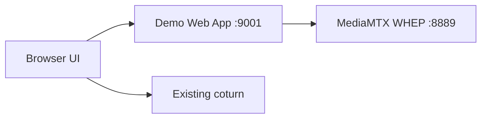

# WHEP Evolution Plan

This branch introduces the first step from the current peer-to-peer demo toward a standards-based WHEP architecture.

## Why This Change

The current project is based on:

- a custom WebSocket signaling server
- browser-to-browser WebRTC negotiation
- TURN fallback through `coturn`

That is enough for validation, but it does not expose a standard media endpoint.

To provide a standard playback endpoint, the project needs a media server that speaks WHEP.

## Selected Media Server

This branch adds `MediaMTX` as the first WHEP-capable media server for a stable playback-focused setup.

The choice is based on its official repository and configuration:

- MediaMTX describes itself as a live media server that can publish and read WebRTC streams.
- Its sample configuration contains:
  - `webrtcAddress`
  - `webrtcLocalUDPAddress`
  - `webrtcICEServers2`
  - `whep://` source support

Sources:

- [MediaMTX GitHub repository](https://github.com/bluenviron/mediamtx)
- [MediaMTX sample configuration](https://raw.githubusercontent.com/bluenviron/mediamtx/main/mediamtx.yml)

## What This Branch Adds

1. `mediamtx` service in `docker-compose.yml`
2. `mediamtx/mediamtx.yml` as a safe starter config
3. `public/whep-player.html` as a minimal WHEP playback page
4. an always-available built-in `demo-stream` (H264) exposed by MediaMTX

## What This Branch Does Not Yet Do

This is not the final architecture yet.

It still does not include:

- a BFF-issued WHEP session bootstrap flow
- a managed stream catalog
- auth around WHEP playback

## Current Compose Topology

## Next Recommended Steps

1. Verify that `MediaMTX` starts correctly.
2. Validate playback via `/whep-player.html`.
3. Confirm that the WHEP answer advertises the Tailscale IP instead of container-only addresses.
4. Introduce a BFF endpoint that returns WHEP URL + TURN credentials.
5. Replace the current custom viewer flow with a WHEP-based player flow.
